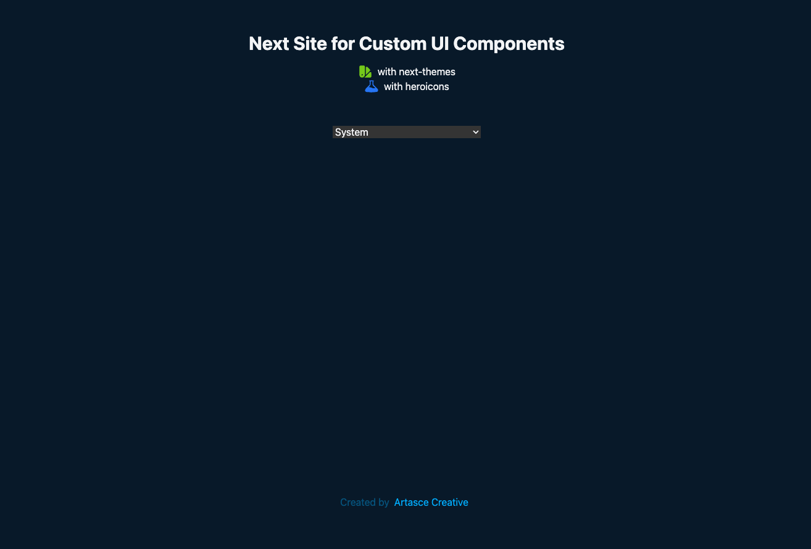

# Artasce Next UI

Here is the Deep Dive with Next and Tailwind CSS...

https://artasce-next.vercel.app

### Step 6 (next)
Installing Favicons, updates to page titles, site meta... create very basic landing for update screenshot.

### Step 5
Setting up HeadlessUI from TailwindCSS - successfully completed... Added ListBox, switching to Radio Group for the DarkMode toggle...

### Step 4
Added `next-themes` and setup darkmode toggle

### Step 3
Setup CSS Vars, updated README, set body/bg colors, ready for Next.js docs review...

### Step 2 
Establish Github Repository and setup Vercel for hosting and for automated builds...

### Step 1
Removed boilerplate and Integrated TailwindCSS using TailwindCSS Documention for Next.js Framework


> below is original from 'npx create-next-app'
This is a [Next.js](https://nextjs.org/) project bootstrapped with [`create-next-app`](https://github.com/vercel/next.js/tree/canary/packages/create-next-app).

## Getting Started

First, run the development server:

```bash
npm run dev
# or
yarn dev
```

Open [http://localhost:3000](http://localhost:3000) with your browser to see the result.

You can start editing the page by modifying `pages/index.js`. The page auto-updates as you edit the file.

[API routes](https://nextjs.org/docs/api-routes/introduction) can be accessed on [http://localhost:3000/api/hello](http://localhost:3000/api/hello). This endpoint can be edited in `pages/api/hello.js`.

The `pages/api` directory is mapped to `/api/*`. Files in this directory are treated as [API routes](https://nextjs.org/docs/api-routes/introduction) instead of React pages.

## Learn More

To learn more about Next.js, take a look at the following resources:

- [Next.js Documentation](https://nextjs.org/docs) - learn about Next.js features and API.
- [Learn Next.js](https://nextjs.org/learn) - an interactive Next.js tutorial.

You can check out [the Next.js GitHub repository](https://github.com/vercel/next.js/) - your feedback and contributions are welcome!

## Deploy on Vercel

The easiest way to deploy your Next.js app is to use the [Vercel Platform](https://vercel.com/new?utm_medium=default-template&filter=next.js&utm_source=create-next-app&utm_campaign=create-next-app-readme) from the creators of Next.js.

Check out our [Next.js deployment documentation](https://nextjs.org/docs/deployment) for more details.


# Next steps...

Now creating a few branches for development...

Starting with a cleanup for the landing, goals, plans, tools, etc.

## Goals

-   next.js / tailwind (this site)
-   redocly open api starter
-   dist component library (react)
-   adobe xd design system
-   design system website (next/redocly/storybook)

> from research
https://docusaurus.io/docs/installation

```bash
npx create-docusaurus@latest my-website classic
```
and with typescript
```bash
npx create-docusaurus@latest my-website classic --typescript
```


